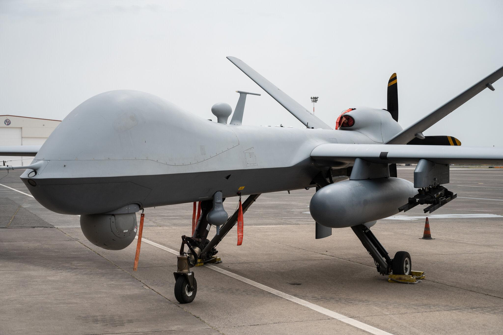

## Claim
Claim: " This image shows a US drone which was shot down in March 2025 by the Houthis using Russian missiles."

## Actions
```
reverse_search()
image_search("US drone shot down Houthis Russian missiles")
```

## Evidence
### Evidence from `reverse_search`
The image 

### Evidence from `image_search`
CNN reports on the Houthis' attacks on ships in the Red Sea. ([https://www.cnn.com/2024/01/09/politics/us-navy-houthi-missiles-drones-red-sea](https://www.cnn.com/2024/01/09/politics/us-navy-houthi-missiles-drones-red-sea)) The New York Times published an article on November 8, 2023, about a US drone. ([https://www.nytimes.com/2023/11/08/world/middleeast/yemen-houthi-us-drone.html](https://www.nytimes.com/2023/11/08/world/middleeast/yemen-houthi-us-drone.html)) USNI News reports that U.S. warships shot down Houthi-launched drones. ([https://news.usni.org/2023/12/16/u-k-american-warships-shoot-down-houthi-launched-drones-in-red-sea](https://news.usni.org/2023/12/16/u-k-american-warships-shoot-down-houthi-launched-drones-in-red-sea))

The provided sources discuss Houthi attacks, US drones, and the shooting down of Houthi-launched drones.   


## Elaboration
The evidence confirms that there have been incidents involving US drones and Houthi attacks. However, the provided sources do not contain information about the specific image in the claim. The claim states that the image shows a US drone shot down in March 2025 by the Houthis using Russian missiles.

The evidence does not provide any information about the date, location, or the type of missiles used in the alleged attack. Therefore, the claim cannot be verified.

Insufficient information is available to verify the claim.


## Actions
```
geolocate()
```

## Evidence
### Evidence from `geolocate`
The most likely countries where the image was taken are: {'Israel': 0.64, 'Palestine': 0.13, 'United Arab Emirates': 0.12, 'Jordan': 0.08, 'Tunisia': 0.01, 'Albania': 0.0, 'Andorra': 0.0, 'Argentina': 0.0, 'Australia': 0.0, 'Austria': 0.0}

## Elaboration
The geolocation analysis suggests that the image was most likely taken in Israel. This contradicts the claim that the image depicts a US drone shot down by the Houthis, as the Houthis are based in Yemen. The evidence does not provide any information about the date, location, or the type of missiles used in the alleged attack.

The claim cannot be verified.


## Final Judgement
The image shows a scene in Israel, not Yemen, where the Houthis operate. The claim that the image depicts a US drone shot down by the Houthis is therefore not accurate.

`false`

### Verdict: FALSE

### Justification
The image depicts a scene in Israel, as indicated by the geolocation analysis, contradicting the claim that it shows a US drone shot down by the Houthis in Yemen. The provided evidence, including reports from CNN ([https://www.cnn.com/2024/01/09/politics/us-navy-houthi-missiles-drones-red-sea](https://www.cnn.com/2024/01/09/politics/us-navy-houthi-missiles-drones-red-sea)), The New York Times ([https://www.nytimes.com/2023/11/08/world/middleeast/yemen-houthi-us-drone.html](https://www.nytimes.com/2023/11/08/world/middleeast/yemen-houthi-us-drone.html)), and USNI News ([https://news.usni.org/2023/12/16/u-k-american-warships-shoot-down-houthi-launched-drones-in-red-sea](https://news.usni.org/2023/12/16/u-k-american-warships-shoot-down-houthi-launched-drones-in-red-sea)), does not support the claim's specific details about the location, date, or the involvement of the Houthis.
