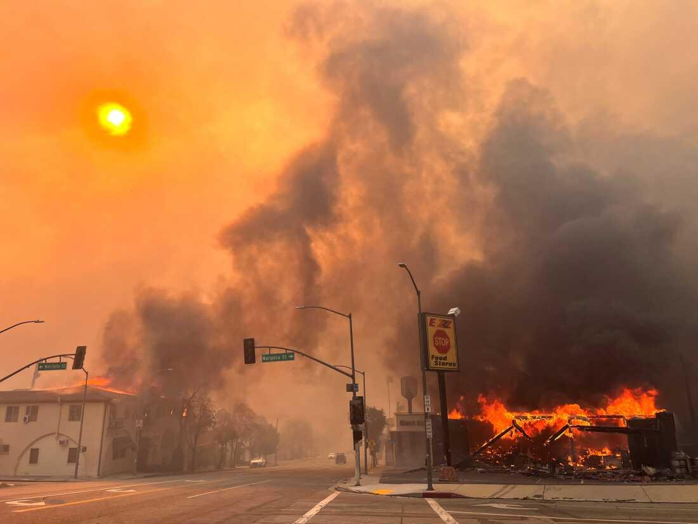
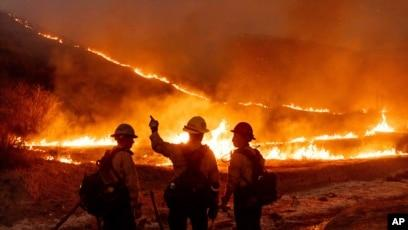

## Claim
Claim: "Russia offered assistance for the California wildfires from January 2025."

## Actions
```
image_search("California wildfires January 2025 Russia assistance")
```

## Evidence
### Evidence from `image_search`
The search results discuss California wildfires. One source from Securing Democracy includes an image from Sputnik  that discusses California wildfires and Ukraine. The image's OCR mentions the LA County Fire Department donating equipment to Ukraine in 2022. Another source from NPR.org contains an image of a fire .

The Voice of America discusses Russia exploiting California wildfires to push propaganda .


## Elaboration
The evidence indicates that Russia has been involved in the discussion of California wildfires. However, the evidence does not mention Russia offering assistance for the California wildfires in January 2025. The evidence mentions Russia exploiting the wildfires for propaganda.

The claim cannot be verified with the provided evidence.


## Final Judgement
The search results discuss California wildfires and Russia's involvement, including propaganda. However, the evidence does not mention Russia offering assistance for the California wildfires in January 2025.

The claim is not supported by the provided evidence, as there is no mention of Russia offering assistance in January 2025. Therefore, the claim is considered false. `false`


### Verdict: FALSE

### Justification
The search results reveal that Russia has been involved in discussions surrounding California wildfires, including exploiting them for propaganda, but there is no evidence to support the claim that Russia offered assistance for the California wildfires in January 2025.
