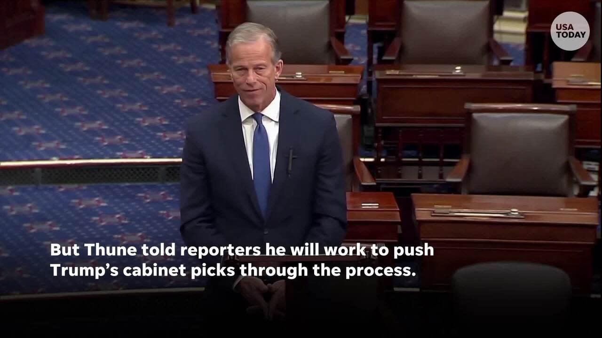
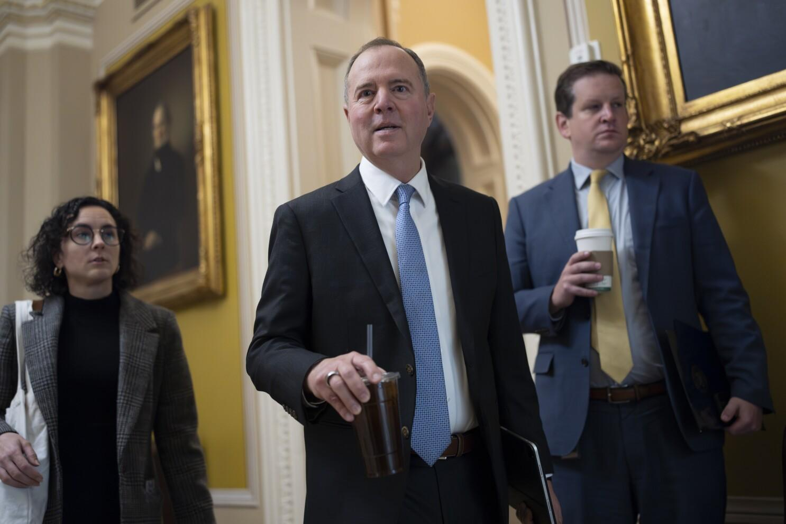

## Claim
Claim: "Majority Leader John Thune blocked Senator Adam Schiff's committee assignments because of his past work in the Russia investigation over Donald Trump."

## Actions
```
image_search("John Thune Adam Schiff committee assignments")
```

## Evidence
### Evidence from `image_search`
From [Source](https://southdakotasearchlight.com/2024/11/06/republicans-take-majority-control-of-u-s-senate-after-ohio-west-virginia-victories/): 
Content: The search result from South Dakota Searchlight contains an image of John Thune. 


## Elaboration
The evidence contains an image of John Thune, but it does not provide any information about Adam Schiff's committee assignments or the reasons behind any potential blocking. Therefore, I cannot verify the claim.


## Actions
```
image_search("Adam Schiff committee assignments blocked John Thune")
```

## Evidence
### Evidence from `image_search`
The Yahoo News search result contains an image.  The Associated Press provides an image of Adam Schiff. 


## Elaboration
The evidence includes images of John Thune and Adam Schiff, but it does not provide any information about committee assignments or the reasons behind any potential blocking. Therefore, I cannot verify the claim.


## Actions
```
image_search("John Thune Adam Schiff committee assignments Russia investigation")
```

## Evidence
No new evidence found.

## Elaboration
The provided evidence does not contain any information to support the claim that John Thune blocked Adam Schiff's committee assignments due to his work in the Russia investigation. The search results only provide images of the individuals involved. Therefore, the claim cannot be verified.


## Final Judgement
The search results provide images of John Thune and Adam Schiff but do not offer any information about committee assignments or the reasons behind any potential blocking. Therefore, the claim cannot be verified.

The decision option that best applies is `false`.


### Verdict: FALSE

### Justification
The provided evidence, including image searches, does not contain any information to support the claim that John Thune blocked Adam Schiff's committee assignments due to his past work in the Russia investigation. Therefore, the claim cannot be verified.
