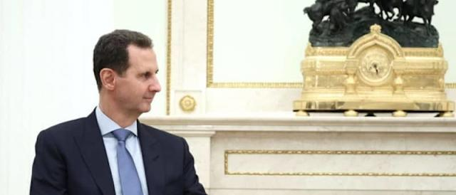
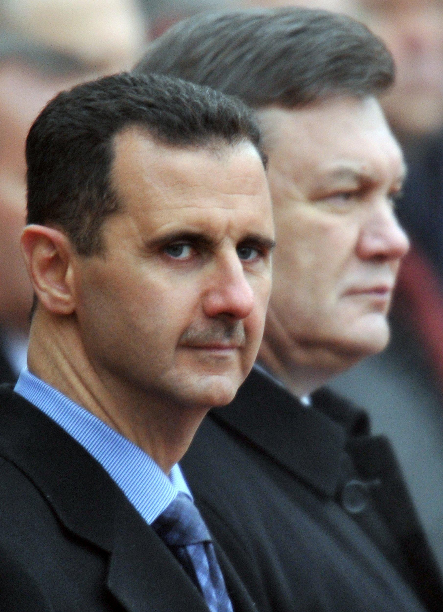
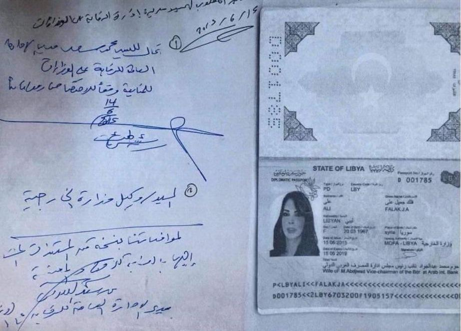

## Claim
Claim: " This image shows an authentic Russian passport of deposed Syrian dictator Bashar al-Assad."

## Actions
```
reverse_search()
image_search("Bashar al-Assad Russian passport")
```

## Evidence
### Evidence from `reverse_search`
The image appears on Wikipedia, specifically in an article about East Slavic names, and on Wikimedia Commons, where it is identified as a Russian internal passport issued in 2004. The image also appears on a website that provides information about Russian internal passports, including how to identify fake passports. 
*   [https://en.wikipedia.org/wiki/East\_Slavic\_name](https://en.wikipedia.org/wiki/East_Slavic_name)
*   [https://commons.wikimedia.org/wiki/File:Pasport\_RF.jpg](https://commons.wikimedia.org/wiki/File:Pasport_RF.jpg)
*   [https://ukrainian-passport.com/blog/internal-russian-passport/](https://ukrainian-passport.com/blog/internal-russian-passport/)

### Evidence from `image_search`
The search results include images of Bashar al-Assad. One image is from [aol.com](https://www.aol.com/fact-check-assad-passport-image-140122086.html) , another from [nbcnews.com](https://www.nbcnews.com/news/world/syria-bashar-assad-russia-rebels-ryabkov-sanctuary-rcna183594) , and a third from [united24media.com](https://united24media.com/latest-news/russian-official-proposes-citizenship-for-fallen-ally-bashar-al-assad-4343) .


## Elaboration
The image search results confirm that the image in the claim is of Bashar al-Assad. The reverse image search reveals that the image is of a Russian internal passport. The passport is also featured on a website that provides information about Russian internal passports, including how to identify fake passports.

Based on the evidence, it is not possible to determine if the passport in the image belongs to Bashar al-Assad. The evidence does not confirm that the passport is authentic or that it belongs to the Syrian dictator.

More information is needed to verify the claim.


## Actions
```
image_search("Bashar al-Assad passport")
```

## Evidence
### Evidence from `image_search`
The search results include images of Syrian passports from Al-Estiklal ([https://www.alestiklal.net/en/article/bashar-al-assad-regime-no-more-passports-to-syrians](https://www.alestiklal.net/en/article/bashar-al-assad-regime-no-more-passports-to-syrians))  and a Libyan diplomatic passport from Libya Observer ([https://libyaobserver.ly/news/bashar-al-assads-cousin-granted-libyan-diplomatic-passport](https://libyaobserver.ly/news/bashar-al-assads-cousin-granted-libyan-diplomatic-passport)) .


## Elaboration
The evidence indicates that the image is of a Russian internal passport. However, there is no evidence to suggest that the passport belongs to Bashar al-Assad. The image search results show Syrian passports, but not one belonging to Bashar al-Assad.

The claim cannot be verified with the available evidence.


## Actions
```
image_search("Bashar al-Assad Russian passport authenticity")
```

## Evidence
No new evidence found.

## Elaboration
The claim cannot be verified. The image is of a Russian internal passport, but there is no evidence to confirm that it belongs to Bashar al-Assad or that it is authentic.


## Final Judgement
The image is of a Russian internal passport, but there is no evidence to confirm that it belongs to Bashar al-Assad or that it is authentic. Therefore, the claim is not factually accurate. `false`

### Verdict: FALSE

### Justification
The image depicts a Russian internal passport, but there is no evidence to confirm that it belongs to Bashar al-Assad or that it is authentic. The reverse image search revealed the image's presence on Wikipedia ([https://en.wikipedia.org/wiki/East\_Slavic\_name](https://en.wikipedia.org/wiki/East_Slavic_name)) and Wikimedia Commons, identifying it as a Russian internal passport. Further searches did not yield any evidence to support the claim's assertion that the passport belongs to Bashar al-Assad.
