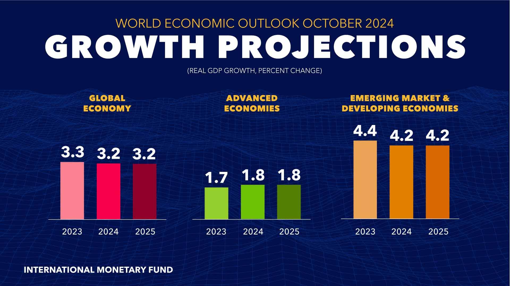
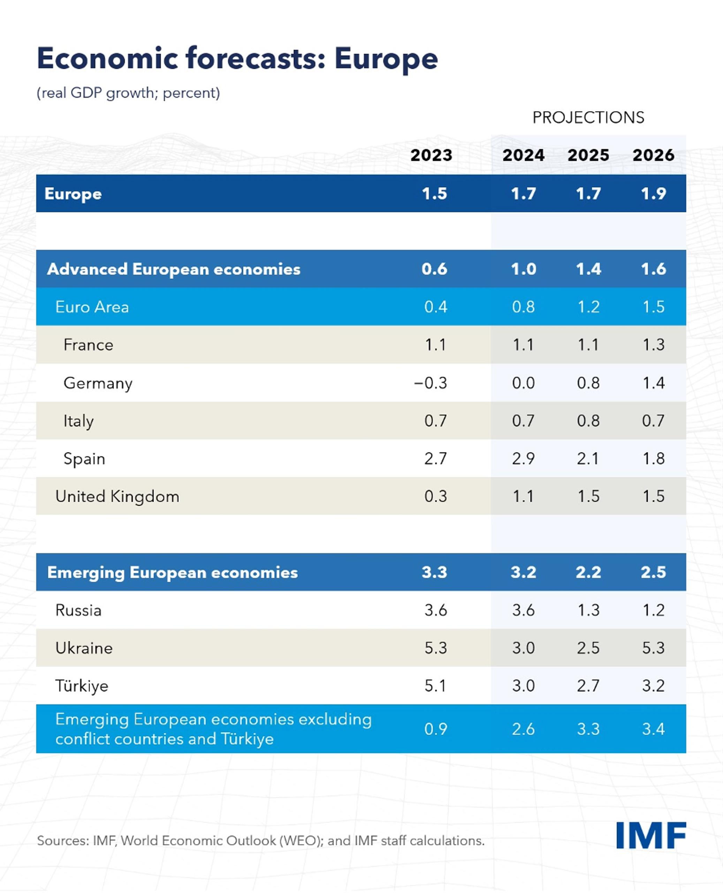
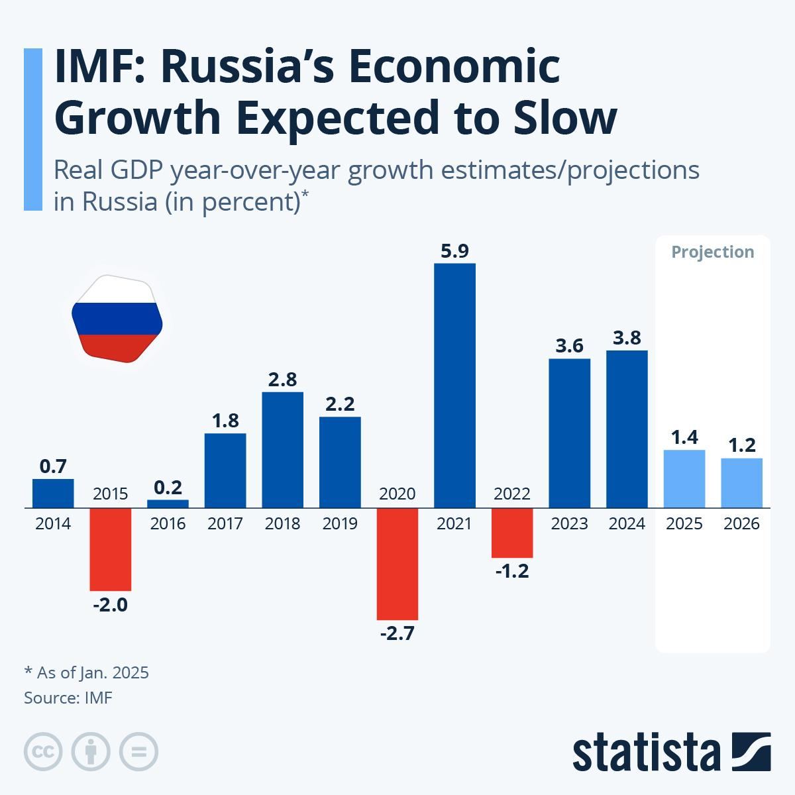
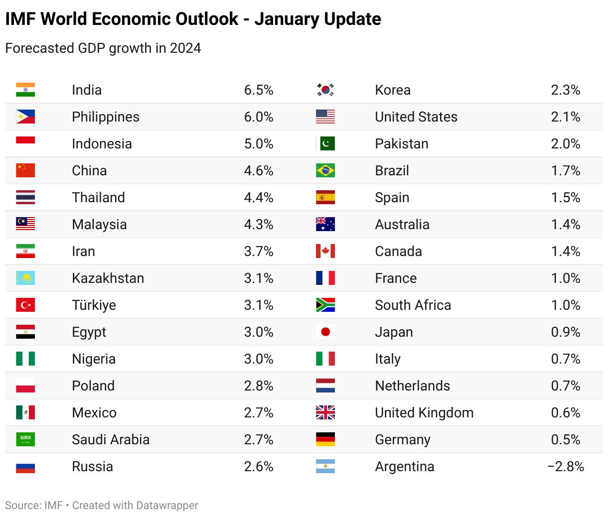

## Claim
Claim: "In October 2024 the International Monetary Fund (IMF) declared Russia the fourth-largest economy in the world."

## Actions
```
image_search("IMF Russia economy October 2024")
```

## Evidence
### Evidence from `image_search`
The International Monetary Fund (IMF) published the World Economic Outlook October 2024 (). The Kyiv Post provides an image from the IMF with economic forecasts for Europe, including real GDP growth projections for Russia for 2024, 2025, and 2026 ().

Statista includes a graph showing the IMF's real GDP year-over-year growth estimates/projections in Russia, "As of Jan. 2025" ().

*   [https://www.imf.org/en/Publications/WEO/Issues/2024/10/22/world-economic-outlook-october-2024](https://www.imf.org/en/Publications/WEO/Issues/2024/10/22/world-economic-outlook-october-2024)
*   [https://www.kyivpost.com/post/41072](https://www.kyivpost.com/post/41072)
*   [https://www.statista.com/chart/34186/real-gdp-year-over-year-growth-estimates-projections-in-russia/](https://www.statista.com/chart/34186/real-gdp-year-over-year-growth-estimates-projections-in-russia/)


## Elaboration
The IMF published the World Economic Outlook October 2024. The Kyiv Post provides an image from the IMF with economic forecasts for Europe, including real GDP growth projections for Russia for 2024, 2025, and 2026. Statista includes a graph showing the IMF's real GDP year-over-year growth estimates/projections in Russia, "As of Jan. 2025".

The evidence confirms that the IMF released economic data in October 2024. However, the provided evidence does not contain information about the IMF declaring Russia the fourth-largest economy in the world.

To verify the claim, I need to find the IMF's ranking of the world's largest economies in October 2024.


## Actions
```
image_search("IMF world economy ranking October 2024")
```

## Evidence
### Evidence from `image_search`
Visual Capitalist presents a graphic showing the fastest-growing economies in 2024, based on IMF data from October 2023 (). The search result from qery.no includes an image from the IMF World Economic Outlook - January Update, showing forecasted GDP growth in 2024, including Russia with a 2.6% growth ().


## Elaboration
The evidence shows that the IMF published economic data in October 2024. However, the search results do not provide information about the IMF's ranking of the world's largest economies in October 2024. The provided images show the fastest-growing economies and forecasted GDP growth, but not the overall economic ranking.

To verify the claim, I need to find the IMF's ranking of the world's largest economies in October 2024.


## Actions
```
image_search("IMF world's largest economies October 2024")
```

## Evidence
No new evidence found.

## Elaboration
The evidence does not support the claim. While the IMF published the World Economic Outlook in October 2024, the search results did not provide any information about the IMF declaring Russia the fourth-largest economy in the world. The available data focuses on economic growth projections, not the overall ranking of economies.


## Final Judgement
The search results confirm that the IMF published economic data in October 2024. However, the evidence does not support the claim that the IMF declared Russia the fourth-largest economy in the world. The search results do not provide any information about the IMF's ranking of the world's largest economies in October 2024.

`false`

### Verdict: FALSE

### Justification
The IMF did publish the World Economic Outlook in October 2024, but the search results do not support the claim that the IMF declared Russia the fourth-largest economy in the world. The available data focuses on economic growth projections, not the overall ranking of economies.
