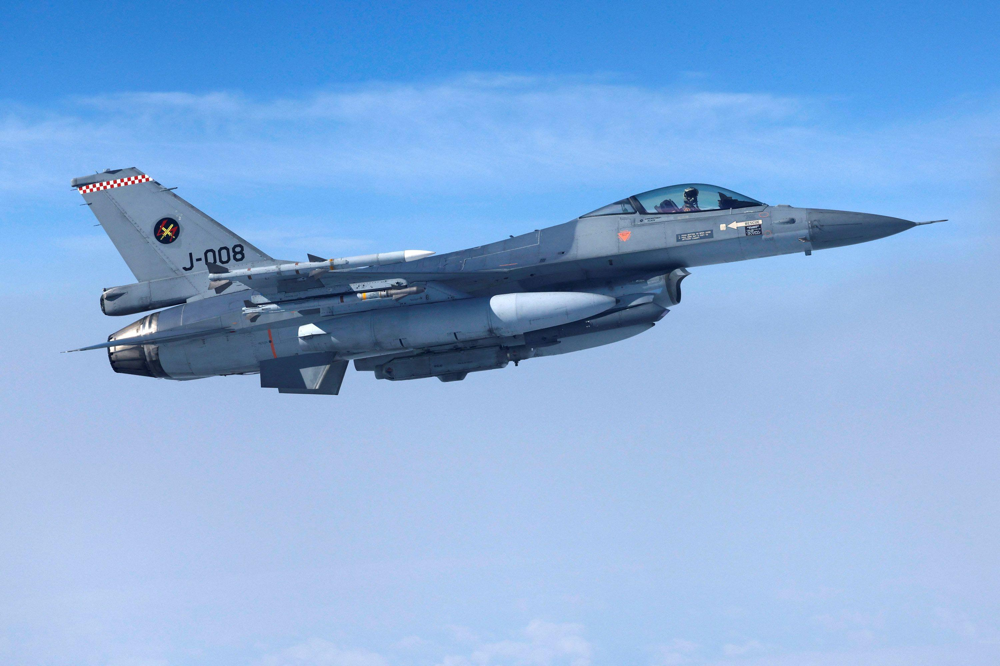
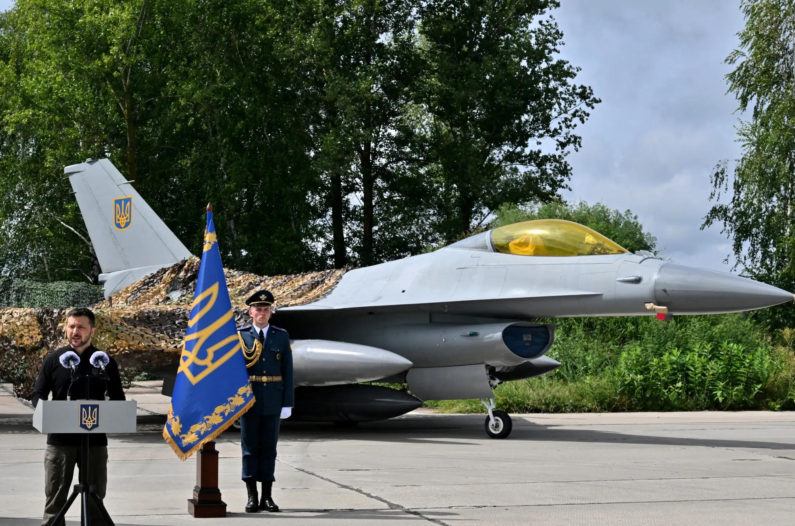

## Claim
Claim: " This image shows a Ukrainian F-16 fighter jet which was shot down by Russia as part of the large-scale Russian invasion in Ukraine."

## Actions
```
reverse_search()
image_search("Ukrainian F-16 fighter jet crash")
```

## Evidence
### Evidence from `reverse_search`
The image in the claim () is of an F-16 Fighting Falcon that crashed into a warehouse near March Air Reserve Base in May 2019. The crash was caused by a loss of hydraulic pressure due to improperly installed parts. The pilot ejected successfully.

The articles discussing the crash were published by The Press-Enterprise ([https://www.pressenterprise.com/2020/05/01/heres-why-the-missiles-on-the-crashed-f-16-near-march-air-reserve-base-did-not-explode/](https://www.pressenterprise.com/2020/05/01/heres-why-the-missiles-on-the-crashed-f-16-near-march-air-reserve-base-did-not-explode/)), Air & Space Forces Magazine ([https://www.airandspaceforces.com/improperly-installed-parts-caused-f-16-to-crash-into-warehouse-in-may-2019/](https://www.airandspaceforces.com/improperly-installed-parts-caused-f-16-to-crash-into-warehouse-in-may-2019/)), and The Sun ([https://www.sbsun.com/2020/04/23/hydraulic-failure-caused-f-16-to-crash-near-march-base-last-year-air-force-says/](https://www.sbsun.com/2020/04/23/hydraulic-failure-caused-f-16-to-crash-near-march-base-last-year-air-force-says/)). The articles include a photo of the crashed F-16 (, ).


### Evidence from `image_search`
NPR ([https://www.npr.org/2024/08/30/g-s1-20234/ukraine-f16-warplane-crash](https://www.npr.org/2024/08/30/g-s1-20234/ukraine-f16-warplane-crash)) and CNN ([https://www.cnn.com/2024/08/29/world/video/ukraine-f16-crashes-npw-nr-intl-digvid](https://www.cnn.com/2024/08/29/world/video/ukraine-f16-crashes-npw-nr-intl-digvid)) both contain images of F-16 fighter jets.  

Bloomberg ([https://www.bloomberg.com/news/articles/2024-08-29/ukraine-says-lost-f-16-jet-in-crash-during-russian-air-strike](https://www.bloomberg.com/news/articles/2024-08-29/ukraine-says-lost-f-16-jet-in-crash-during-russian-air-strike)) reports that Ukraine lost an F-16 jet in a crash. 


## Elaboration
The image in the claim (

## Final Judgement
The image in the claim is of an F-16 that crashed in 2019 due to mechanical failure, not as a result of the Russian invasion. While Ukraine has recently lost an F-16 in a crash, the image is not related to that event.

The claim is demonstrably false because the image is taken out of context. The image is of a crash that occurred in 2019, not as a result of the Russian invasion. `false`

### Verdict: FALSE

### Justification
The image in the claim depicts an F-16 that crashed in 2019 near March Air Reserve Base due to mechanical failure, as reported by The Press-Enterprise ([https://www.pressenterprise.com/2020/05/01/heres-why-the-missiles-on-the-crashed-f-16-near-march-air-reserve-base-did-not-explode/](https://www.pressenterprise.com/2020/05/01/heres-why-the-missiles-on-the-crashed-f-16-near-march-air-reserve-base-did-not-explode/)). This crash is unrelated to the Russian invasion of Ukraine.
